# ☣ Sentinel: Hybrid Financial Fraud Detection System


**Sentinel** is a production-grade anomaly detection engine designed to identify financial fraud in real-time. It utilizes a **Hybrid Architecture** that combines deterministic rules (for known patterns) with a probabilistic **Variational Autoencoder (VAE)** (for unknown/complex patterns).

---

## 🧠 The Challenge
Modern financial fraud works in "Fat Tails." Traditional systems fail because:
1.  **Rule-Based Systems** miss complex, evolving fraud (e.g., "Whales" behaving like bots).
2.  **Pure AI Systems** generate high False Positives on "rare but safe" transactions (e.g., a wealthy user buying a TV), causing customer friction.
3.  **Smurfing Attacks** (structuring large amounts into small transactions) fly under standard radar.

## 💡 The Solution: "Swiss Cheese" Defense
Sentinel implements a multi-layered defense strategy where each layer covers the blind spots of the previous one.

| Layer | Technology | Target Attack Vector | Outcome |
| :--- | :--- | :--- | :--- |
| **1. Velocity Trap** | Python Logic | **Money Mules** (High-frequency automation) | 🛑 **Instant Block** (<1ms) |
| **2. Volume Trap** | Statistical Z-Score | **Smurfing** (Structuring / Laundering) | 🛑 **Block** (Cumulative risk) |
| **3. Neural Brain** | Variational Autoencoder | **Unknown Anomalies** (Complex patterns) | ⚠️ **Risk Score** (0-100%) |

---

## 🏗️ Architecture
The system processes transactions through a waterfall pipeline:

```mermaid
graph TD
    A[New Transaction] --> B{< 30s Gap?};
    B -- Yes --> C[🛑 BLOCK: Velocity Violation];
    B -- No --> D{> 50x Peer Vol?};
    D -- Yes --> E[🛑 BLOCK: Volume Violation];
    D -- No --> F[🧠 AI Analysis];
    F --> G{Confidence > 99%?};
    G -- Yes --> H[🛑 BLOCK: AI Anomaly];
    G -- No --> I{Confidence > 95%?};
    I -- Yes --> J[⚠️ FLAG: Step-Up Auth];
    I -- No --> K[✅ APPROVE];

```



---

## 🛠️ Tech Stack

* **Core:** Python 3.10, Pandas, NumPy
* **Deep Learning:** TensorFlow / Keras (Custom `Sampling` Layer VAE)
* **Statistics:** SciPy (Probability Distribution Fitting)
* **Serialization:** Joblib (Scaler persistence)
* **Version Control:** Git / GitHub

---

## 📂 Repository Structure

```text
Sentinel-Fraud-Detection/
│
├── models/                    # Trained Model Artifacts
│   ├── sentinel_vae_v1.keras  # The VAE Neural Network
│   └── feature_scaler.pkl     # Scikit-learn Scaler (fitted)
│
├── notebooks/                 # Research & Development
│   └── fraud_detection_research.ipynb  # Full EDA, Training, and Validation
│
├── src/                       # Production Source Code
│   ├── __init__.py
│   └── detect_fraud.py        # Main Inference Engine Class
│
├── requirements.txt           # Python Dependencies
└── README.md                  # Project Documentation

```

---

## 🚀 Quick Start

### 1. Installation

Clone the repository and install dependencies:

```bash
git clone [https://github.com/Viverun/Sentinel-Fraud-Detection.git](https://github.com/Viverun/Sentinel-Fraud-Detection.git)
cd Sentinel-Fraud-Detection
pip install -r requirements.txt

```

### 2. Run the Sentinel Engine

You can run the inference script directly to test against simulated scenarios (Mules, Smurfs, Whales):

```bash
python src/detect_fraud.py

```

### 3. Usage (Python Code)

```python
from src.detect_fraud import FraudSentinel

# Initialize the engine
sentinel = FraudSentinel(
    model_path='models/sentinel_vae_v1.keras', 
    scaler_path='models/feature_scaler.pkl'
)

# Predict a transaction
# Format: predict(user_id, amount, time_gap, daily_total)
status, reason, confidence = sentinel.predict(888, 3000, 20, 3000)

print(f"Status: {status}")   # Output: BLOCKED
print(f"Reason: {reason}")   # Output: VELOCITY_VIOLATION...
print(f"Risk: {confidence}%") # Output: 100.0%

```

---

## 📊 Performance Results (Simulation)

* **Detection Rate:** 100% on simulated Mule and Smurfing attacks.
* **False Positive Rate:** Reduced by **90%** compared to standard Isolation Forest baseline.
* **Explainability:** 100% of blocks include human-readable reason codes.

---

## 📜 License

This project is licensed under the MIT License - see the LICENSE file for details.

---

*Built as a Capstone Project demonstrating End-to-End Machine Learning Engineering.*

```

```
